<div align="center">



<br/>

<a href="https://www.linkedin.com/in/long-nguyen-vu/"></a>
<a href="https://scholar.google.com/citations?user=hPE1ZaEAAAAJ&hl=en"></a>
<a href="https://patents.google.com/?inventor=%EC%9D%91%EC%9B%AC%EB%B6%80%EB%A0%81"></a>
<a href="mailto:horcrux@duck.com"></a>










<details>
<summary><code>🔐 ./decrypt --archive</code></summary>

<br/>

<div align="left">

```text
[ selected transmissions ]

  2025  SpaceNet ............ multimodal sound source localization   · Sensors
  2024  CHAWA ............... phase anomalies in sound localization  · IEEE Access
  2024  Triad Training ...... audio deepfake detection               · Interspeech
  2023  Spoofing vs. Adv. ... defending countermeasures              · IEEE Access
  2021  AdMat ............... CNN-on-matrix Android malware          · IEEE Access
  2019  Fragmentation ....... Android malware detection              · Computers & Security
  2017  Rooting Arms Race ... evasion vs. detection                  · SCN

[ now building ]

  AI for SecOps ....... AI that helps SOCs triage and investigate alerts
  AI Security ......... keeping models safe from injection & abuse
  AppSec .............. securing the software around them

[ payloads ]

  devenv-linux ····· devenv-macos ····· devenv-windows (it's WSL. shh.)
```

→ [full list on Google Scholar](https://scholar.google.com/citations?user=hPE1ZaEAAAAJ&hl=en) · [patents](https://patents.google.com/?inventor=%EC%9D%91%EC%9B%AC%EB%B6%80%EB%A0%81) · [devenv-linux](https://github.com/nguyenvulong/devenv-linux) · [devenv-macos](https://github.com/nguyenvulong/devenv-macos) · [devenv-windows](https://github.com/nguyenvulong/devenv-windows)

</div>
</details>


</div>
